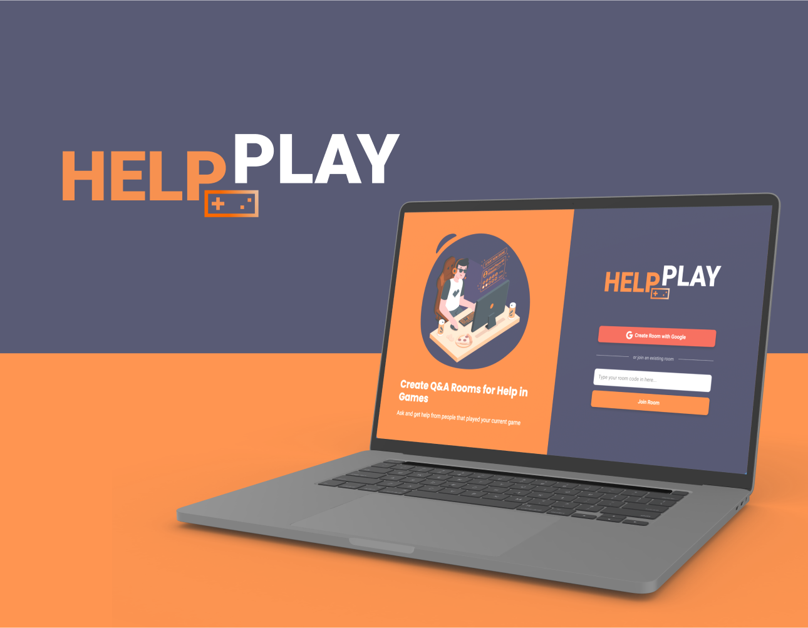

<h1 align="center">
    
</h1>

## 👨🏼‍💻 Tech Used:

This project was build with the stack below:

- [React](https://reactjs.org)
- [Firebase](https://firebase.google.com/)
- [TypeScript](https://www.typescriptlang.org/)

## 🚀 Running:

Cloning:

```bash
$ git clone https://github.com/fillipeags/help_play.git
$ cd help_play
```

Starting
```bash
$ yarn
$ yarn start
```

Just a reminder: Firebase account and Realtime Database are required to run it properly - env.local not included on github

## 💻 Projeto

This project was initialy a Q&A plataform for people to help each other with tech related stuff. Further i've decided to change into a Game Helper for people who are often stuck on some part of that game of the moment.

The base project was made during the Next-Level-Week by Rocketseat
**[Next Level Week Together](https://nextlevelweek.com/)**

## 📝 License

Esse projeto está sob a licença MIT. Veja o arquivo [LICENSE](LICENSE.md) para mais detalhes.
